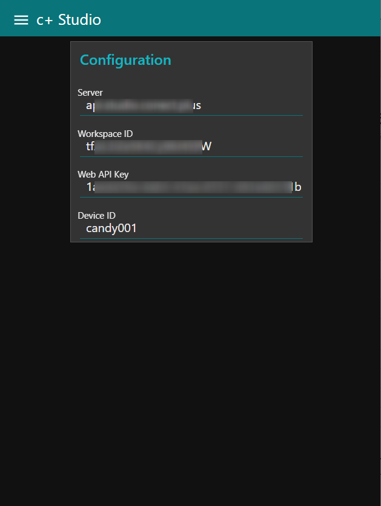

# c+ Studio Cloud Flows

conect+ Studio is a Iot data design and management tool.

* [https://www.conect.plus/studio](https://www.conect.plus/studio)

The follwoing cloud flows are supported.

* [2JCIE-BU01](../../sensor/2jcie-bu01/README.md)

## Usage

Please configure c+ Studio settings using a helper dashoboard.

* Import [candy-red_cplus_config.json](./common/candy-red_cplus_config.json) to CANDY RED and deploy it.
* Access to CANDY RED dashboard.
* Fill in settings.

