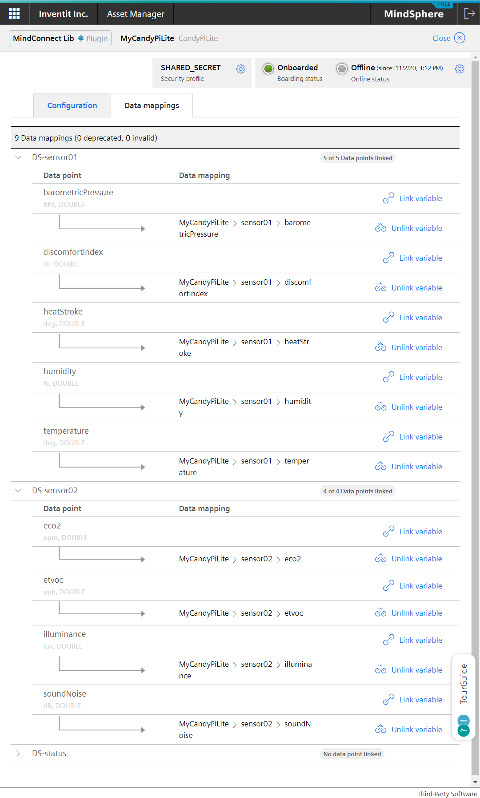

# MindSphere - 2JCIE-BU01 cloud flow

A cloud flow to upload readings read from 2JCIE-BU01.

## Usage

1. Create an asset on MindSphere and start to onboarding.
1. Import [candy-red_mindsphere_2jcie-bu01.json](./candy-red_mindsphere_2jcie-bu01.json) to CANDY RED and deploy it.
1. Configure MindConnect node to bind data points.

Asset should have the follwoing variables.

| Name | Unit | Data Type |
| :--- | :--- | :-------- |
| barometricPressure | hPa | DOUBLE |
| discomfortIndex | DI | DOUBLE |
| heatStroke | deg |DOUBLE |
| humidity | % |DOUBLE |
| temperature | deg | DOUBLE |
| eco2 | ppm | DOUBLE |
| etvoc | ppb | DOUBLE |
| illuminance | lux | DOUBLE |
| soundNoise | dB | DOUBLE |

Data mappings should be below.

## Specification

* Retrieve sensor values from the 2JCIE-BU01 sensor flow every 10 minutes, which contains a mean of the last 10 minutes.
* Upload mean values to MindSphere. Max and min are ignored.

